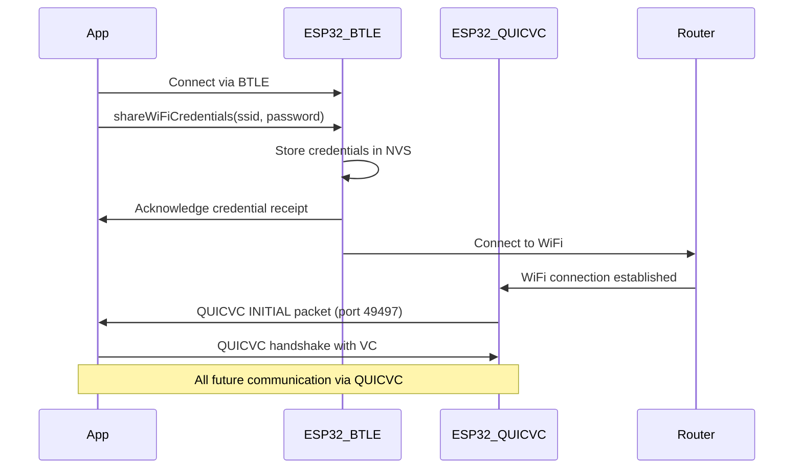

# Bluetooth LE (BTLE) Integration Documentation

## Overview

This document describes the Bluetooth LE integration for IoT device discovery and communication in the LAMA mobile app. BTLE serves as a complementary transport to QUICVC, providing:

- **WiFi Configuration**: Initial device setup and credential provisioning
- **Fallback Transport**: When WiFi/UDP is unavailable or unreliable
- **BTLE-Only Devices**: Support for devices without WiFi capability (rings, wearables)
- **Cross-Platform Reuse**: Shared implementation across mobile and desktop platforms

## Transport Comparison: BTLE vs QUICVC

### Protocol Efficiency

| Aspect | BTLE | QUICVC |
|--------|------|--------|
| Discovery Overhead | 31 bytes (advertisement) + connection | 65 bytes (single broadcast packet) |
| Authentication | 6+ packets (pairing process) | 2 packets (VC exchange) |
| Connection Setup | Required for data exchange | Connectionless discovery |
| Encryption | After pairing | Built into handshake |
| Credential Exchange | Via GATT characteristics | Native VC frames |

### Use Case Selection

**Use BTLE when:**
- Device has no WiFi capability (rings, simple sensors)
- WiFi credentials need to be provisioned
- Operating in WiFi-restricted environments
- Need ultra-low power consumption

**Use QUICVC when:**
- Device has WiFi/Ethernet connectivity
- Need broadcast discovery without connections
- Require verified credentials for authentication
- Want minimal handshake overhead

## Architecture

### Universal BTLE Service

The `UniversalBTLEService` provides a unified interface for discovering and communicating with multiple types of BTLE-enabled devices:

- **ESP32 Devices**: WiFi credential sharing, fallback communication
- **Ring Devices**: Health/fitness data collection and battery monitoring  
- **Wearable Devices**: Fitness tracking and sensor data
- **Generic IoT Devices**: Flexible service discovery and basic communication

### Device Discovery Flow

```mermaid
sequenceDiagram
    participant App
    participant BLTEService
    parameter Device
    participant UI
    
    App->>BLTEService: startDiscovery()
    BLTEService->>BLTEService: Start BTLE scan with supported service UUIDs
    Device->>BLTEService: Advertises services
    BLTEService->>BLTEService: Check if device is supported
    BLTEService->>BLTEService: Determine device type (ESP32/Ring/Wearable/IoT)
    BLTEService->>App: emit('deviceDiscovered', device)
    App->>UI: Update device list with BTLE status icons
```

## Supported Device Types

### ESP32 Devices

**Service UUID**: `12345678-1234-1234-1234-123456789abc`

**Characteristics**:
- `Device Info` (`...789abd`): Device information and status
- `LED Control` (`...789abe`): LED control commands
- `WiFi Credentials` (`...789abf`): WiFi credential sharing
- `Heartbeat` (`...789ac0`): Connection keepalive

**Features**:
- WiFi credential provisioning via BTLE
- LED control over BTLE (same as WiFi)
- Device ownership via QUICVC credentials
- Seamless handover from BTLE to WiFi

### Ring Devices

**Standard Services**:
- Battery Service (`0000180F-0000-1000-8000-00805F9B34FB`)
- Device Information Service (`0000180A-0000-1000-8000-00805F9B34FB`)

**Detection**:
- Device name contains "ring" or "oura"
- Advertises battery service
- Device type explicitly set to "ring"

**Features**:
- Battery level monitoring
- Health data synchronization
- Pairing and authentication

### Wearable/Fitness Devices

**Standard Services**:
- Running Speed and Cadence (`0000180D-0000-1000-8000-00805F9B34FB`)
- Battery Service (`0000180F-0000-1000-8000-00805F9B34FB`)

**Features**:
- Fitness data collection
- Battery monitoring
- Real-time sensor data

## Service Implementation

### Supported GATT Services

The system automatically discovers and supports these standard GATT services:

```javascript
SUPPORTED_SERVICES = [
  '12345678-1234-1234-1234-123456789abc', // Custom ESP32 service
  '0000180F-0000-1000-8000-00805F9B34FB', // Battery Service
  '0000180D-0000-1000-8000-00805F9B34FB', // Running Speed and Cadence
  '0000180A-0000-1000-8000-00805F9B34FB', // Device Information
  '00001800-0000-1000-8000-00805F9B34FB', // Generic Access
  '00001801-0000-1000-8000-00805F9B34FB'  // Generic Attribute
]
```

### Device Type Detection

The service intelligently detects device types using multiple criteria:

```javascript
// ESP32 Detection
- Custom service UUID present
- Name contains "esp32" 
- Manufacturer is "Espressif"

// Ring Detection  
- Name contains "ring" or "oura"
- Has battery service
- Device type is "ring"

// Generic Detection
- Has any supported GATT service
- Classified as Wearable/Fitness/IoT based on services
```

## WiFi Credential Sharing

### Overview

ESP32 devices discovered via BTLE can receive WiFi credentials to enable QUICVC connectivity. This provides a migration path from BTLE to the more efficient QUICVC protocol:

1. **Initial Setup**: Device discovered via BTLE when WiFi not configured
2. **Credential Sharing**: Receive WiFi SSID/password via BTLE characteristic
3. **WiFi Connection**: Device connects to WiFi network
4. **Protocol Upgrade**: Device switches to QUICVC for all future communication

### Credential Sharing Flow



### Implementation

```typescript
// Share WiFi credentials with ESP32 device
await btleService.shareWiFiCredentials(deviceId, "MyWiFi", "password123");

// Credential format sent to device
const credentials = {
  type: 'wifi_credentials',
  ssid: 'MyWiFi',
  password: 'password123', 
  timestamp: Date.now()
};
```

## Device Status Indicators

### WiFi Status Icons

- **Blue Icon**: WiFi connectivity active (device reachable via WiFi)
- **Gray Icon**: WiFi connectivity inactive (device not on WiFi)
- **Hidden**: Device type doesn't support WiFi (e.g., rings)

### BTLE Status Icons

- **Blue Icon**: Bluetooth LE connectivity active (device advertising/connected)
- **Gray Icon**: Bluetooth LE connectivity inactive (device not advertising)
- **Hidden**: Device not discovered via BTLE

### Status Logic

```typescript
// Device discovered via UDP WiFi
device.wifiStatus = 'active';
device.btleStatus = 'inactive';

// Device discovered via BTLE only  
device.wifiStatus = 'inactive'; // or undefined for non-WiFi devices
device.btleStatus = 'active';

// Device available via both transports
device.wifiStatus = 'active';
device.btleStatus = 'active';
```

## Integration with Device Discovery

### DeviceDiscoveryModel Integration

The BTLE service is integrated into the main `DeviceDiscoveryModel`:

```typescript
// Initialization during discovery startup
await this.initializeBTLEService();
await this._btleService.startDiscovery();

// Event handling
this._btleService.on('deviceDiscovered', (device) => {
  const discoveryDevice: DiscoveryDevice = {
    deviceId: device.id,
    name: device.name, 
    deviceType: device.type, // ESP32/Ring/Wearable/IoT
    wifiStatus: device.type === 'ESP32' ? 'inactive' : undefined,
    btleStatus: 'active'
  };
  
  this.onDeviceDiscovered.emit(discoveryDevice);
});
```

### UI Integration

Device cards automatically display appropriate status icons:

```tsx
{/* WiFi Status Icon */}
{device.wifiStatus && (
  <MaterialCommunityIcons
    name="wifi"
    size={20}
    color={device.wifiStatus === 'active' ? blue : gray}
  />
)}

{/* BTLE Status Icon */}
{device.btleStatus && (
  <MaterialCommunityIcons
    name="bluetooth"  
    size={20}
    color={device.btleStatus === 'active' ? blue : gray}
  />
)}
```

## Service Capabilities by Device Type

| Device Type | QUICVC | BTLE | WiFi Config | VC Auth | Health Data |
|-------------|--------|------|-------------|---------|-------------|
| ESP32       | ✅     | ✅   | ✅ (via BTLE) | ✅     | ❌          |
| Ring        | ❌     | ✅   | ❌           | ❌     | ✅          |
| Wearable    | ❌     | ✅   | ❌           | ❌     | ✅          |
| IoT Generic | Varies | ✅   | Varies      | Varies | Varies      |

## Protocol Selection Strategy

The app automatically selects the optimal protocol based on device capabilities and network conditions:

1. **QUICVC First**: For WiFi-capable devices, QUICVC is preferred due to:
   - Lower overhead (65 bytes vs multiple BTLE packets)
   - Built-in credential verification
   - No connection setup required for discovery
   - Encrypted channel after 2-packet handshake

2. **BTLE Fallback**: Used when:
   - Device lacks WiFi capability
   - WiFi credentials need provisioning
   - QUICVC discovery fails
   - Device explicitly requires BTLE (rings, wearables)

3. **Hybrid Operation**: ESP32 devices support both:
   - BTLE for initial WiFi configuration
   - QUICVC for authenticated communication post-setup
   - Seamless protocol switching based on availability

This dual-protocol approach ensures maximum compatibility while optimizing for efficiency where possible.