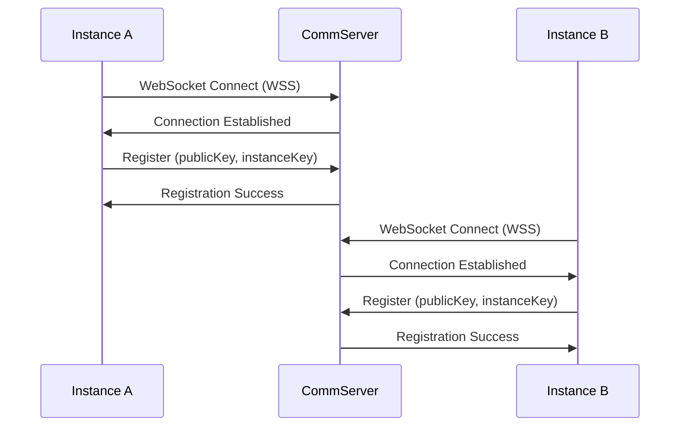
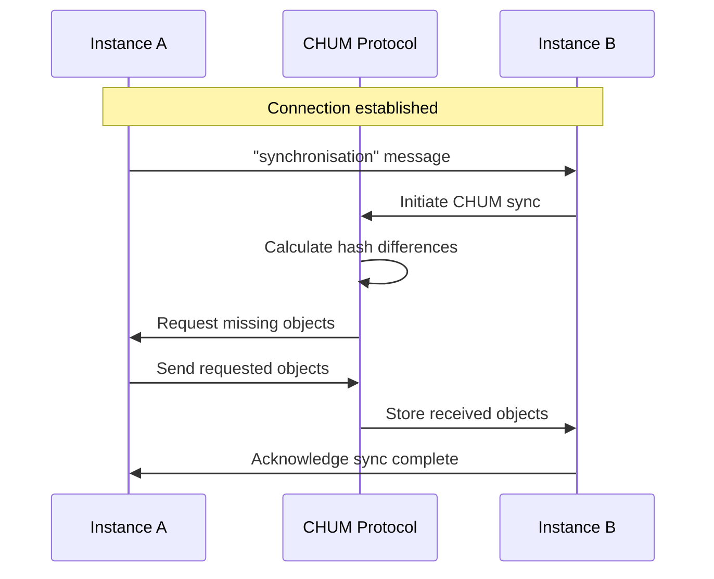

# Connection Establishment Between Instances (CHUM)

## Overview

This document describes the complete connection establishment process between instances of our software. The system uses a **Communication Server (CommServer)** as a central facilitator to enable secure connections between browser instances, supporting both **Internet of People (IoP)** and **Internet of Me (IoM)** connection types.

## High-Level Connection Flow

### Connection Establishment Phases Overview

**1. Registration & Discovery**
- Both instances connect to the CommServer (`wss://comm10.dev.refinio.one`)
- Each instance registers its identity (person ID, instance ID, public keys)
- CommServer maintains a routing table of active instances

**2. Invitation Creation**
- Initiating instance (A) creates an invitation with a unique token
- Invitation contains cryptographic challenge and connection metadata
- CommServer stores the invitation mapping for later lookup

**3. Invitation Distribution**
- Invitation is encoded and shared via QR code, link, or file
- The invitation contains the token that links back to the CommServer session

**4. CommServer-Mediated Connection Request**
- Target instance (B) presents the invitation token to CommServer
- CommServer validates token and identifies the initiating instance
- CommServer forwards the connection request to instance A
- Instance A acknowledges the connection back through CommServer

**5. Cryptographic Authentication**
- Instances exchange cryptographic challenges through CommServer
- Each validates the other's identity using public/private key pairs
- CommServer facilitates the secure handshake process

**6. Connection Establishment**
- Upon successful authentication, CommServer confirms the connection
- Both instances receive pairing success callbacks
- Direct communication channel is established between instances

**7. Post-Connection Setup**
- For IoP (Internet of People): Trust relationship and profile exchange
- For IoM (Internet of Me): Device authorization and IoM request creation
- Connection becomes active for data exchange

### CommServer's Key Role

The CommServer acts as a **trusted intermediary** that:
- **Discovers** instances and maintains their availability
- **Routes** messages between instances that don't have direct connectivity
- **Validates** invitation tokens and prevents unauthorized connections
- **Facilitates** the cryptographic handshake without seeing private keys
- **Confirms** successful connections and triggers callbacks

This architecture allows browser-based instances to connect securely without requiring direct network connectivity, as the CommServer handles all the discovery and initial connection establishment logistics.

## Architecture Overview

```
┌─────────────┐    ┌─────────────────┐    ┌─────────────┐
│   Instance  │    │   CommServer    │    │   Instance  │
│      A      │◄──►│ (WebSocket WSS) │◄──►│      B      │
│             │    │                 │    │             │
│  Browser    │    │ comm10.dev.     │    │  Browser    │
│  App        │    │ refinio.one     │    │  App        │
└─────────────┘    └─────────────────┘    └─────────────┘
```

## Core Components

### 1. CommServer Communication Infrastructure

The CommServer acts as the central communication hub using WebSocket Secure (WSS) connections:

- **Endpoint**: `wss://comm10.dev.refinio.one`
- **Protocol**: WebSocket Secure (WSS)
- **Purpose**: Facilitates discovery, message routing, and connection establishment

### 2. Identity System

Each instance has a unique identity defined in `.id.json` files:

```json
{
    "type": "public",
    "personEmail": "3A9ZyqMkcstGLT9rl7qG-0QgKs0viS4fOc4wYWnC0G-vpz2W3F5AmhgT_C5eHGSH",
    "instanceName": "9-1T8r2cJ8u2I84C4o0tLC1xV3U5cUqFnK2MaTTFNID38QZIUM_XN3u-rjGKsDhY",
    "personKeyPublic": "853f49f16d52fdc7d1f8d4fc2659336b651a78b41fdfdb4d92d8308ee63f4544",
    "personSignKeyPublic": "ffc31a8a32535a6fd242701a4f31b24508318509e196217a02ada67a8bbca885",
    "instanceKeyPublic": "6ef2442adb0277f9983d4d6715bcf3ddec37dfd651120ab63f3c5dbf48ac3606",
    "instanceSignKeyPublic": "0b05a6cc0b2c9ed1e2d29c451745be10f5c39ce022b788b2c0e39825b136ace9",
    "url": "wss://comm10.dev.refinio.one"
}
```

## Connection Establishment Phases

### Phase 1: Initialization and Discovery



### Phase 2: Invitation-Based Connection

```mermaid
sequenceDiagram
    participant A as Instance A
    participant CS as CommServer
    participant B as Instance B
    
    Note over A: User initiates pairing
    A->>A: Generate invitation token
    A->>CS: Create invitation mapping
    CS->>A: Invitation stored
    
    Note over A,B: Share invitation via QR/Link
    
    B->>CS: Connect using invitation
    CS->>CS: Validate token
    CS->>A: Forward connection request
    A->>CS: Accept connection
    CS->>B: Connection accepted
    
    Note over A,B: Cryptographic handshake
    A<->B: Exchange challenges/responses
    
    Note over A,B: Connection established
```

### Phase 3: CHUM Synchronization

After connection establishment, instances automatically synchronize data using the CHUM (Content Hash Universal Metadata) protocol:



## Critical Implementation Details

### Access Grant Management

**IMPORTANT**: Access grants MUST be created by `LeuteAccessRightsManager` ONLY, following the one.leute pattern:

```typescript
// CORRECT: In LeuteAccessRightsManager
channelManager.onUpdated((channelInfoIdHash, channelId, channelOwner, timeOfEarliestChange, data) => {
    createAccess([{
        id: channelInfoIdHash,
        person: [],
        group: this.groups('iom'),
        mode: SET_ACCESS_MODE.ADD
    }]).catch(console.error);
});

// INCORRECT: DO NOT create access grants in CommServerManager or other components
// This causes duplicate access grants and breaks CHUM sync
```

**CRITICAL DISCOVERY**: The `onUpdated` event only fires when messages are added to a channel, NOT when the channel is created. This means:
- ChannelInfo objects don't get access grants at creation time
- Other participants can't see the channel until a message is sent
- This breaks the "both channels visible" requirement for 1-to-1 chats

**SOLUTION**: For 1-to-1 channels, access grants must be created immediately after channel creation:
```typescript
// In ChatModel after createChannel:
if (topicId.includes('<->') && this.appModel) {
    await this.appModel.leuteAccessRightsManager.grantAccessFor1to1Channel(topicId, actualOwner);
}
```

### CHUM Protocol Integration

The CHUM protocol expects objects in specific formats:
- Regular objects: Serialized as microdata starting with `<div itemscope itemtype="//refin.io/"`
- ID objects: Serialized with `data-id-object="true"` attribute

When the format is incorrect, you'll see errors like:
```
M2O-PH1: This does not look like valid ONE microdata (isIdObj is false)
```

### ChumPlugin Integration

The `ChumPlugin` is automatically injected into all connections via a monkey-patch in `installChumPluginPatch.ts`. This ensures:
1. CHUM control messages like "synchronisation" pass through to the protocol handler
2. JSON-based plugins don't interfere with plain-text CHUM messages
3. All connections support CHUM synchronization without manual configuration

## Connection Types

### Internet of People (IoP) Connections

Standard person-to-person connections:
- Create trust relationships
- Exchange profiles
- Enable communication channels

### Internet of Me (IoM) Connections

Connections between a person's own devices:
- Device authorization required
- Full data synchronization
- Shared identity across devices

## Security Model

1. **End-to-end encryption**: All data is encrypted between instances
2. **Identity verification**: Public key cryptography ensures identity
3. **Token-based pairing**: Time-limited tokens prevent unauthorized connections
4. **CommServer isolation**: Server only routes messages, cannot decrypt content

## Troubleshooting

### Common Issues

1. **CHUM sync fails with microdata errors**
   - Check that access grants are created only by LeuteAccessRightsManager
   - Ensure no duplicate access grant creation in other components

2. **"synchronisation" message not handled**
   - Verify ChumPlugin is properly injected via installChumPluginPatch
   - Check that the plugin allows CHUM messages to pass through

3. **Connection establishment fails**
   - Verify WebSocket connection to CommServer
   - Check invitation token validity (15-minute expiration)
   - Ensure both instances are registered with CommServer

## Best Practices

1. **Follow one.leute patterns exactly** - The reference implementation works correctly
2. **Single responsibility** - Each component should have one clear purpose
3. **Access grants** - Only create in LeuteAccessRightsManager
4. **Error handling** - Log detailed information for debugging
5. **Testing** - Test with multiple device pairs to ensure reliability