# CommServer Implementation Documentation

## Overview

This document describes the complete CommServer implementation for enabling lama ↔ edda.one pairing. The implementation replaces the complex one.models ConnectionsModel with a direct, simplified approach using WebSocket connections to `wss://comm10.dev.refinio.one`.

## Architecture

The CommServer implementation consists of four main components working together:

```
┌─────────────────┐    ┌──────────────────┐    ┌─────────────────────┐    ┌─────────────────┐
│   NetworkPlugin │────│ AppModel         │────│ CommServerManager   │────│ CommServerProtocol │
│                 │    │                  │    │                     │    │                 │
│ WebSocket       │    │ Message          │    │ Token Storage       │    │ Authentication  │
│ Connection      │    │ Routing          │    │ Connection Mgmt     │    │ & Crypto        │
│ Management      │    │                  │    │                     │    │                 │
└─────────────────┘    └──────────────────┘    └─────────────────────┘    └─────────────────┘
```

## Critical Authentication Protocol Fix

### ❌ **Previous Issue: CYENC-SYMDEC Error**

The implementation initially failed with:
```
WebSocket closed: 1000 Close called: CYENC-SYMDEC: Decryption with symmetric key failed
```

**Root Cause**: We were **signing** the authentication challenge when the CommServer expects **encrypted** data.

### ✅ **Solution: Encryption-Based Authentication**

The CommServer authentication protocol requires:

1. **Receive**: `authentication_request` with `challenge` (base64) and `publicKey` (hex)
2. **Process**: 
   - Decode base64 challenge to `Uint8Array`
   - Convert CommServer public key from hex to `PublicKey` type
   - **ENCRYPT** challenge with CommServer's public key (not sign it!)
3. **Send**: `authentication_response` with encrypted challenge as hex string

**Correct Implementation**:
```typescript
// WRONG: Signing the challenge
const signatureBytes = cryptoApi.sign(challengeBytes);

// CORRECT: Encrypting the challenge  
const encryptedResponse = cryptoApi.encryptAndEmbedNonce(challengeBytes, commServerPublicKeyBytes);
```

### 🔧 **Technical Details**

- **CryptoApi Method**: `encryptAndEmbedNonce(data, otherPublicKey)` 
- **Key Conversion**: `ensurePublicKey(hexToUint8Array(commServerPublicKey))`
- **Challenge Processing**: Base64 decode → Uint8Array → Encrypt → Hex encode
- **Message Format**: `{ command: 'authentication_response', response: <hex_string> }`

## Components

### 1. NetworkPlugin (`src/models/network/NetworkPlugin.ts`)

**Purpose**: WebSocket connection management and message routing to CommServer

**Key Features**:
- WebSocket connection to `wss://comm10.dev.refinio.one`
- Automatic reconnection with exponential backoff
- Health monitoring via ping/pong
- Connection state tracking and statistics
- **Special handling for authentication responses**: Converts `Uint8Array` to hex string

**Message Flow**:
```typescript
// Handles Uint8Array → hex conversion for authentication
if (message.command === 'authentication_response' && message.response instanceof Uint8Array) {
  processedMessage = {
    ...message,
    response: uint8arrayToHexString(message.response)
  };
}
```

### 2. CommServerManager (`src/models/network/CommServerManager.ts`)

**Purpose**: Connection lifecycle management and token validation

**Key Features**:
- Connection registration and tracking
- Invitation token storage and validation (64-char base64url tokens)
- Statistics collection and monitoring
- Event emission for pairing requests
- Protocol error handling

**Token Management**:
```typescript
// Secure token generation
const token = generateSecureToken(); // 64-char base64url
this.activeInvitations.set(token, { /* invitation data */ });
```

### 3. CommServerProtocol (`src/models/network/CommServerProtocol.ts`)

**Purpose**: CommServer protocol implementation and cryptographic operations

**Key Features**:
- **Encryption-based authentication** (fixed from signing)
- Message parsing and validation
- Pairing request processing
- Token validation integration
- Comprehensive error handling

**Authentication Flow**:
```typescript
private async createAuthenticationResponse(challenge: string): Promise<Uint8Array> {
  // 1. Decode base64 challenge
  const challengeBytes = new Uint8Array(Buffer.from(challenge, 'base64'));
  
  // 2. Convert CommServer public key
  const commServerPublicKeyBytes = ensurePublicKey(hexToUint8Array(this.commServerPublicKey));
  
  // 3. ENCRYPT (not sign!) the challenge
  const encryptedResponse = cryptoApi.encryptAndEmbedNonce(challengeBytes, commServerPublicKeyBytes);
  
  return encryptedResponse;
}
```

### 4. AppModel Integration (`src/models/AppModel.ts`)

**Purpose**: High-level coordination and pairing request handling

**Key Features**:
- CommServer component initialization and coordination
- Message routing from NetworkPlugin to CommServerManager
- Pairing request processing via `handlePairingRequest()`
- Integration with existing ContactCreationService
- User identity management for CommServer registration

## Authentication Flow (Fixed)


## Pairing Flow

```mermaid
sequenceDiagram
    participant E as edda.one
    participant CS as CommServer
    participant L as lama
    participant CM as ContactCreationService
    
    Note over L: 1. Generate invitation token
    L->>CS: Connected & authenticated
    
    Note over E: 2. User enters invitation token
    E->>CS: communication_request { sourcePublicKey, targetPublicKey, token }
    CS->>L: communication_request (forwarded)
    
    Note over L: 3. Validate token & create contact
    L->>L: Validate invitation token
    L->>CM: createContactFromPairing(edda_publicKey)
    CM->>L: Person → Profile → Someone objects created
    L->>L: Add Someone to contacts
    
    Note over L,E: 4. Connection established
    CS->>E: connection_handover
    CS->>L: connection_handover
```



## Testing

### Integration Test (`src/tests/CommServerIntegrationTest.ts`)

Comprehensive test suite covering:
- AppModel initialization and component availability
- NetworkPlugin connection and authentication
- **Authentication flow with encryption** (fixed)
- Invitation creation and token validation
- Statistics collection and monitoring
- Debug interface functionality
- Mock pairing request simulation

### Test Runner (`src/scripts/runCommServerTest.ts`)

Automated test execution with detailed reporting:
```bash
npx ts-node src/scripts/runCommServerTest.ts
```

## Debugging

### Debug Screen (`src/components/diagnostics/CommServerDebugScreen.tsx`)

Real-time monitoring interface:
- Connection status with color-coded indicators
- CommServer statistics (connections, authentication, pairing)
- Interactive debug commands (reconnect, clear invitations, test auth)
- Message logging with filtering and timestamps
- Auto-refresh capability

### Debug Commands

```typescript
// Force reconnection
networkPlugin.reconnect();

// Clear active invitations  
commServerManager.clearActiveInvitations();

// Test authentication flow
commServerManager.testAuthentication();

// Send test message
networkPlugin.sendTestMessage();
```

## Configuration

### Environment Variables

Required API keys and endpoints:
```bash
# CommServer URL (default: wss://comm10.dev.refinio.one)
COMM_SERVER_URL=wss://comm10.dev.refinio.one

# Optional: Custom endpoints
AZURE_OPENAI_ENDPOINT=https://your-endpoint.openai.azure.com/
OLLAMA_BASE_URL=http://localhost:11434/api
```

### NetworkPlugin Configuration

```typescript
const config = {
  url: 'wss://comm10.dev.refinio.one',
  maxReconnectAttempts: 10,
  reconnectInterval: 5000,
  pingInterval: 30000,
  pongTimeout: 5000
};
```

## Error Handling

### Common Issues and Solutions

1. **CYENC-SYMDEC: Decryption with symmetric key failed** ✅ **FIXED**
   - **Cause**: Using signing instead of encryption for authentication
   - **Solution**: Use `cryptoApi.encryptAndEmbedNonce()` instead of `cryptoApi.sign()`

2. **Buffer Import Issues** ✅ **FIXED**
   - **Cause**: Node.js Buffer not available in React Native/Expo
   - **Solution**: Use `NodeBuffer` from `@refinio/one.core/lib/system/expo/buffer`

3. **WebSocket Connection Failures**
   - **Cause**: Network connectivity or CommServer unavailability
   - **Solution**: Automatic reconnection with exponential backoff

4. **Token Validation Failures**
   - **Cause**: Invalid or expired invitation tokens
   - **Solution**: Proper token generation and validation logic

## Performance Considerations

- **Connection Pooling**: Single WebSocket connection per app instance
- **Message Batching**: Efficient message queuing and processing
- **Memory Management**: Proper cleanup of event listeners and connections
- **Reconnection Strategy**: Exponential backoff to prevent server overload

## Security

- **Token Security**: 64-character base64url tokens with secure generation
- **Encryption**: All authentication uses public key encryption
- **Connection Validation**: Cryptographic challenge-response authentication
- **Input Validation**: Comprehensive message format validation

## Future Enhancements

1. **Connection Multiplexing**: Support multiple simultaneous connections
2. **Message Encryption**: End-to-end encryption for all CommServer messages
3. **Connection Persistence**: Maintain connections across app lifecycle
4. **Advanced Monitoring**: Detailed performance and security metrics

---

## Summary

The CommServer implementation provides a robust, secure foundation for lama ↔ edda.one pairing. The critical authentication fix (encryption vs signing) resolves the core connectivity issue, enabling reliable peer-to-peer connections through the CommServer infrastructure.

**Key Success Factors**:
- ✅ **Correct authentication protocol** (encryption-based)
- ✅ **Expo/React Native compatibility** (Buffer handling)
- ✅ **Comprehensive error handling** and debugging tools
- ✅ **Integration with existing contact management** systems
- ✅ **Thorough testing** and monitoring capabilities 