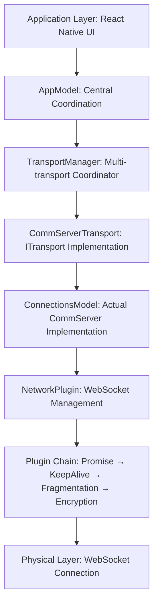
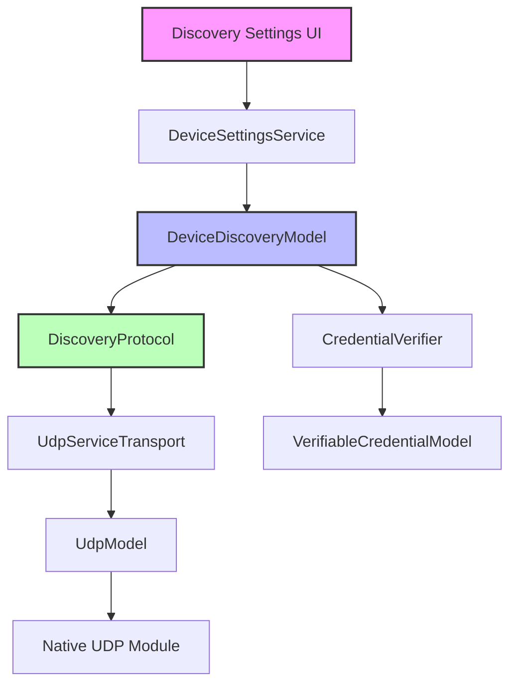
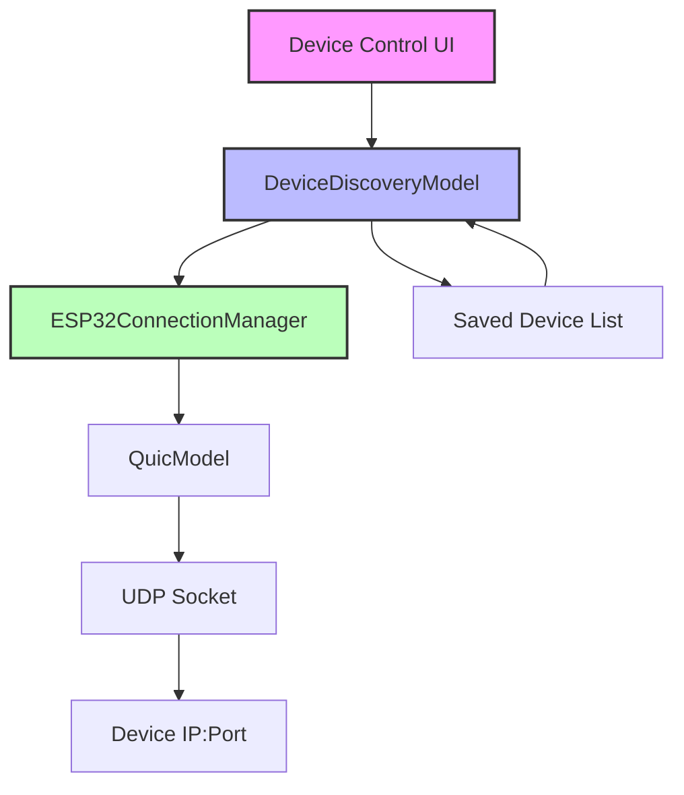
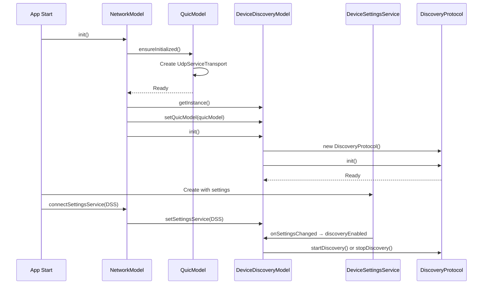

# Network Architecture in Lama Application

This document outlines the complete multi-transport network architecture in the Lama application, which uses `@refinio/one.models` as the underlying protocol implementation. Understanding this layered architecture is critical for debugging connection issues and extending transport capabilities.

## High-Level Overview

The networking stack is a **multi-layered architecture** designed to support multiple transport types while maintaining compatibility with the one.models protocol framework. The architecture follows a clear separation of concerns:



## Layered Architecture Components

### **1. TransportManager** (Top Level)
**Location**: `src/models/network/TransportManager.ts`
**Role**: Multi-transport coordination and management

**Responsibilities**:
- **Transport Registration**: Manages multiple transport types (CommServer, UDP P2P, BLE, future transports)
- **Transport Selection**: Chooses optimal transport based on preferences and target capabilities
- **Event Coordination**: Bridges events between transports and upper application layers
- **Lifecycle Management**: Handles initialization, shutdown, and failover for all transports
- **Connection Routing**: Routes connection requests to appropriate transport implementations

**Architecture Philosophy**:
```typescript
// TransportManager will eventually manage a plethora of different comms channels:
// - CommServerTransport: Legacy WebSocket-based CommServer approach
// - P2PTransport: UDP discovery and direct local network connections  
// - BLETransport: Offline Bluetooth Low Energy communication
// - Future transports can be added without changing existing architecture
```

### **2. CommServerTransport** (ITransport Implementation)
**Location**: `src/models/network/transports/ConnectionsModelTransport.ts`
**Role**: CommServer transport wrapper implementing ITransport interface

**Responsibilities**:
- **Interface Compliance**: Implements ITransport interface for TransportManager compatibility
- **ConnectionsModel Management**: Wraps and manages the actual ConnectionsModel instance
- **Event Bridging**: Bridges autonomous ConnectionsModel events to transport interface
- **Configuration Management**: Handles CommServer-specific configuration and lifecycle
- **Quality Reporting**: Provides transport-specific capabilities and connection quality metrics

**Key Features**:
```typescript
// CommServerTransport implements our legacy CommServer approach:
// - Wraps ConnectionsModel to conform to unified ITransport interface
// - Manages ConnectionsModel lifecycle (init, shutdown, error handling)
// - Bridges ConnectionsModel's autonomous events to TransportManager
// - Provides CommServer-specific capabilities and quality reporting
```

### **3. ConnectionsModel** (Actual Implementation)
**Location**: `@refinio/one.models/lib/models/ConnectionsModel.js`
**Role**: Real one.models CommServer protocol implementation

**Responsibilities**:
- **Protocol Implementation**: Handles all CommServer protocol details autonomously
- **WebSocket Management**: Manages WebSocket connections via NetworkPlugin
- **Pairing Protocol**: Implements device pairing and authentication flows
- **Encryption & Security**: Handles authentication, encryption, and access control
- **Event Emission**: Emits events for connection state changes and protocol events

**Configuration** (Current Production Settings):
```typescript
{
  commServerUrl: 'wss://comm10.dev.refinio.one',
  acceptIncomingConnections: true,    // ✅ Required for pairing protocol
  establishOutgoingConnections: true, // ✅ Required for pairing protocol  
  allowPairing: true,                 // ✅ Required for pairing protocol
  acceptUnknownInstances: true,       // ✅ Accept pairing from unknown instances
  acceptUnknownPersons: false,        // ✅ Security: Only known persons
  allowDebugRequests: true,
  pairingTokenExpirationDuration: 60000 * 15 // 15 minutes like one.leute
}
```

**Architecture Philosophy**:
```typescript
// ConnectionsModel IS the actual implementation of CommServer based communications:
// - Handles all CommServer protocol details without external coordination
// - Manages WebSocket connections autonomously via NetworkPlugin
// - Implements pairing, authentication, encryption protocols
// - Emits events for connection state changes and protocol completion
// - Requires no external coordination once configured and started
```

## Component Relationships

### **Data Flow** (Outgoing Messages)
```
Application → AppModel → TransportManager → CommServerTransport → ConnectionsModel → NetworkPlugin → WebSocket
```

### **Event Flow** (Incoming Events)
```
WebSocket → NetworkPlugin → ConnectionsModel → CommServerTransport → TransportManager → AppModel → Application
```

### **Initialization Sequence**
```
1. AppModel creates TransportManager with dependencies
2. TransportManager creates CommServerTransport with ConnectionsModel
3. CommServerTransport configures ConnectionsModel with proper settings
4. TransportManager.init() → CommServerTransport.init() → ConnectionsModel.init()
5. Event bridging established for autonomous operation
6. System ready for connections and pairing
```

## Transport Interface Abstraction

The `ITransport` interface provides a unified API for all transport types:

```typescript
interface ITransport {
  readonly type: TransportType;
  status: TransportStatus;
  
  // Lifecycle
  init(): Promise<void>;
  shutdown(): Promise<void>;
  
  // Connections
  connect(target: ConnectionTarget): Promise<any>;
  disconnect(connectionId: string): Promise<void>;
  
  // Capabilities
  getCapabilities(): TransportCapabilities;
  getConnectionQuality(connectionId: string): Promise<ConnectionQuality>;
  
  // Events
  onConnectionEstablished: OEvent<(connection: any) => void>;
  onConnectionClosed: OEvent<(connectionId: string, reason?: string) => void>;
  onStatusChanged: OEvent<(status: TransportStatus) => void>;
}
```

This abstraction allows the TransportManager to:
- Treat all transports uniformly regardless of underlying implementation
- Add new transport types without changing existing code
- Implement transport selection and failover logic generically
- Provide unified connection management across all transport types

## Device Discovery Architecture

### **Overview**

The device discovery system enables automatic discovery of devices on the local network and future Bluetooth/ESP32 devices. **Discovery is a completely separate service from device communication** - devices can be controlled and communicated with regardless of whether discovery is active or not.

**Key Points:**
- **Discovery Service**: Only used to find new devices on the network
- **Device Communication**: Works independently once device addresses are known
- **Persistent Storage**: Discovered devices are saved and can be communicated with even when discovery is disabled
- **Direct Communication**: Devices communicate directly via UDP/QUIC on known addresses, not through discovery broadcasts

### **Discovery vs Communication Architecture**

**Discovery Service** (Finding devices):
- Uses UDP broadcast on port 49497
- Sends periodic discovery requests
- Only needed to find new devices
- Can be completely disabled without affecting existing device communication

**Device Communication** (Controlling/interacting with devices):
- Uses direct UDP/QUIC connections to device IP:port
- Works with saved device information
- Independent of discovery service status
- Supports authenticated commands (LED control, etc.)

### **Discovery Stack**



### **Device Communication Stack** (Separate from Discovery)



### **Core Components**

#### **1. DeviceDiscoveryModel**
**Location**: `src/models/network/DeviceDiscoveryModel.ts`
**Role**: Central coordinator for device discovery

**Responsibilities**:
- **State Management**: Tracks discovery enabled/disabled state
- **Device Registry**: Maintains list of discovered devices
- **Settings Integration**: Responds to user settings changes
- **Credential Management**: Integrates with CredentialVerifier for device trust
- **Event Coordination**: Emits events for device discovery, updates, and loss

**Key Features**:
- Singleton pattern for global access
- Forcibly disabled flag for user control
- Integration with DeviceSettingsService for UI control
- Automatic credential verification for discovered devices

#### **2. DiscoveryProtocol**
**Location**: `src/models/network/discovery/DiscoveryProtocol.ts`
**Role**: Implements the discovery protocol over transport

**Responsibilities**:
- **Message Protocol**: Defines discovery request/response format
- **Broadcast Management**: Sends periodic UDP broadcast messages
- **Device Tracking**: Tracks discovered devices with timeout
- **Transport Abstraction**: Works with any IQuicTransport implementation

**Discovery Message Format**:
```typescript
interface DiscoveryMessage {
  type: 'discovery_request' | 'discovery_response';
  deviceId: string;
  deviceName: string;
  deviceType: string;
  capabilities: string[];
  version: string;
  timestamp: number;
}
```

**Configuration**:
```typescript
{
  discoveryPort: 49497,           // Standard discovery port
  discoveryInterval: 5000,        // Broadcast every 5 seconds
  maxAge: 30000,                 // Remove devices after 30s silence
  broadcastAddress: '255.255.255.255' // Local network broadcast
}
```

#### **3. UdpServiceTransport**
**Location**: `src/models/network/transport/UdpServiceTransport.ts`
**Role**: UDP transport implementation with service routing

**Responsibilities**:
- **Service Routing**: Routes messages to handlers by service type
- **UDP Socket Management**: Creates and manages UDP sockets
- **Message Framing**: Adds service type byte to messages
- **Error Handling**: Robust error handling for network issues

**Service Types**:
```typescript
enum NetworkServiceType {
  DISCOVERY_SERVICE = 1,    // Device discovery
  CREDENTIAL_SERVICE = 2,   // Credential exchange
  DATA_SERVICE = 3,        // Data transfer
  CONTROL_SERVICE = 5      // Control messages
}
```

### **Network Settings UI Structure**

The network settings UI is organized as a hierarchical navigation structure:

```
Settings Screen
└── Network Settings (/(screens)/network)
    ├── Device Discovery (/(screens)/network/discovery)
    │   ├── Enable/Disable Discovery Toggle
    │   ├── Auto-Connect Toggle
    │   ├── Add Only Connected Devices Toggle
    │   └── Discovery Port Configuration
    │
    ├── Connection Management (/(screens)/network/connection)
    │   ├── Active Connections List
    │   ├── Pending Invitations
    │   ├── Device Management
    │   └── Contact Integration
    │
    ├── Advanced Settings (/(screens)/network/advanced)
    │   ├── CommServer URL Configuration
    │   ├── Connection Timeouts
    │   ├── Protocol Settings
    │   └── Debug Options
    │
    └── Network Diagnostics (/(screens)/network/diagnostics)
        ├── CommServer Protocol Test
        ├── Invitation Compatibility Test
        ├── UDP Packet Monitor
        └── Connection Status Overview
```

**Navigation Implementation**:
- Main network settings screen at `app/(screens)/network/index.tsx`
- Each subsection in its own file (discovery.tsx, connection.tsx, etc.)
- Uses Expo Router for navigation
- Consistent theming with React Native Paper

### **Device Control Without Discovery**

**Important**: Device control features like LED toggling work independently of the discovery service:

1. **Saved Devices**: Once a device has been discovered and saved, it can be controlled anytime
2. **Direct Communication**: Commands are sent directly to the device's saved IP:port
3. **No Discovery Required**: The discovery toggle only affects finding new devices
4. **Persistent Control**: LED control, ownership management, and other features work regardless of discovery status

**Example Flow**:
1. Enable discovery → Find ESP32 device → Device saved with IP/port
2. Disable discovery → Device still appears in list (from saved data)
3. Toggle LED → Command sent directly to saved IP:port
4. LED responds → No discovery service involved

### **Current Implementation Status**

#### ✅ **Working Features**:
1. **UDP Discovery**
   - Broadcast discovery on port 49497
   - Periodic announcement messages
   - Device timeout and pruning
   - Service type routing

2. **Settings Integration**
   - Toggle discovery from UI
   - Persistent settings storage
   - Real-time enable/disable

3. **Device Management**
   - Track discovered devices
   - Update device information
   - Remove stale devices

4. **Network UI**
   - Main network settings screen with navigation menu
   - Dedicated discovery settings view
   - Connection management view
   - Advanced settings view
   - Network diagnostics tools

### **Discovery Initialization Flow**

The discovery system follows a specific initialization sequence to ensure proper setup:



**Key Points**:
1. NetworkModel initializes QuicModel first (transport layer)
2. DeviceDiscoveryModel is created and linked to QuicModel
3. DiscoveryProtocol is initialized with transport
4. DeviceSettingsService is connected after models are ready
5. Discovery starts/stops based on user settings

#### ❌ **Missing Features**:

1. **Bluetooth Discovery**
   - No BLE transport implementation
   - No Bluetooth scanning/advertising
   - No Bluetooth permissions handling

2. **ESP32 Integration**
   - No ESP32-specific protocols
   - No ESP32 device type handling
   - No ESP32 credential exchange

3. **Multi-Transport Discovery**
   - Single transport (UDP) only
   - No transport selection logic
   - No discovery result merging

### **Planned Bluetooth/ESP32 Architecture**

#### **Bluetooth Transport Layer**

```typescript
class BluetoothTransport implements IQuicTransport {
  // BLE scanning and advertising
  async startScanning(): Promise<void>;
  async startAdvertising(serviceUUID: string): Promise<void>;
  
  // Connection management
  async connectToDevice(deviceId: string): Promise<void>;
  async disconnectFromDevice(deviceId: string): Promise<void>;
  
  // Data transfer
  async send(data: Uint8Array, deviceId: string): Promise<void>;
  onMessage: OEvent<(data: Uint8Array, deviceId: string) => void>;
  
  // Service registration (same as UDP)
  addService(serviceType: number, handler: ServiceHandler): void;
  removeService(serviceType: number): void;
}
```

#### **Multi-Transport Discovery**

```typescript
class MultiTransportDiscovery {
  private transports: Map<string, IQuicTransport>;
  private discoveryProtocols: Map<string, DiscoveryProtocol>;
  
  // Add transport with its discovery protocol
  addTransport(name: string, transport: IQuicTransport): void {
    this.transports.set(name, transport);
    this.discoveryProtocols.set(name, new DiscoveryProtocol(config, transport));
  }
  
  // Start discovery on all transports
  async startDiscovery(): Promise<void> {
    for (const protocol of this.discoveryProtocols.values()) {
      await protocol.startDiscovery();
    }
  }
  
  // Merge discovered devices from all transports
  getDevices(): Device[] {
    const allDevices = new Map<string, Device>();
    for (const protocol of this.discoveryProtocols.values()) {
      for (const device of protocol.getDevices()) {
        // Merge by device ID, preferring most recent
        const existing = allDevices.get(device.id);
        if (!existing || device.lastSeen > existing.lastSeen) {
          allDevices.set(device.id, device);
        }
      }
    }
    return Array.from(allDevices.values());
  }
}
```

#### **ESP32 Device Support**

```typescript
interface ESP32Device extends Device {
  // ESP32-specific fields
  firmwareVersion: string;
  hardwareRevision: string;
  sensorCapabilities: string[];
  batteryLevel?: number;
  
  // ESP32 credential exchange
  publicKey: string;
  certificateChain?: string[];
}

// ESP32-specific discovery config
interface ESP32DiscoveryConfig extends DiscoveryConfig {
  // ESP32 devices may use different ports
  esp32DiscoveryPort: number;
  
  // ESP32-specific service UUIDs for BLE
  esp32ServiceUUID: string;
  esp32CharacteristicUUID: string;
  
  // ESP32 message signing
  requireSignedMessages: boolean;
}
```

### **Debugging Discovery Issues**

#### **Common Problems and Solutions**

1. **Discovery not starting**
   - Check if `DeviceSettingsService.discoveryEnabled` is true
   - Verify QuicModel initialization succeeded
   - Check for port binding errors (port 49497)
   - Enable debug logging: `Debug.enable('one:discovery:*')`

2. **No devices discovered**
   - Ensure devices are on same network subnet
   - Check firewall/network isolation settings
   - Verify broadcast address (255.255.255.255)
   - Use UDP diagnostics tool to monitor packets

3. **Discovery state mismatch**
   - DeviceDiscoveryModel has `forciblyDisabled` flag
   - Check both settings state and model state
   - Look for initialization order issues

#### **Debug Tools**

1. **ESP32DebugHelper** (`src/tools/ESP32DebugHelper.ts`)
   - Comprehensive UDP packet analysis
   - Network interface enumeration
   - Discovery simulation capabilities

2. **UDPDiagnostic** (`src/tools/UDPDiagnostic.ts`)
   - Simple UDP packet monitor
   - Integrated in Network Diagnostics UI
   - Real-time packet inspection

3. **Network Diagnostics Screen**
   - Access via Settings → Network → Diagnostics
   - CommServer protocol testing
   - UDP packet monitoring
   - Connection status overview

### **Implementation Roadmap**

#### **Phase 1: Bluetooth Transport** (Priority: High)
1. Implement `BluetoothTransport` class
2. Add BLE permissions handling
3. Implement scanning and advertising
4. Add service-based message routing
5. Test with mock devices

#### **Phase 2: Multi-Transport Discovery** (Priority: High)
1. Create `MultiTransportDiscovery` coordinator
2. Refactor `DeviceDiscoveryModel` to use coordinator
3. Implement device merging logic
4. Update UI to show transport type
5. Add transport preference settings

#### **Phase 3: ESP32 Integration** (Priority: Medium)
1. Define ESP32 message protocols
2. Implement ESP32 device type handling
3. Add ESP32-specific credential exchange
4. Create ESP32 debug tools
5. Test with real ESP32 devices

#### **Phase 4: Advanced Features** (Priority: Low)
1. Transport failover (WiFi → Bluetooth)
2. Hybrid connections (control over BLE, data over WiFi)
3. Mesh networking support
4. Power-aware discovery modes
5. Background discovery service 