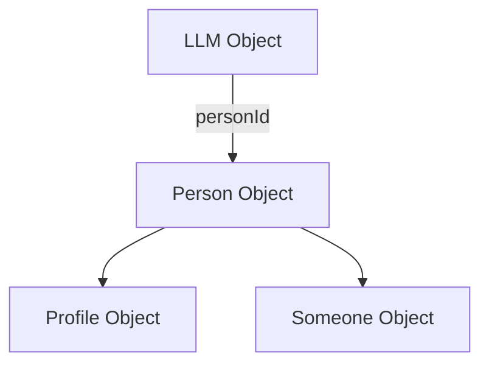

# LLM Architecture in Lama

This document outlines the relationship between the various LLM (Large Language Model) components in the Lama application and how they integrate with the Refinio ONE object model.

## Core Components

### 1. LLM Object

`LLM` is a versioned object type defined in the Refinio ONE system that represents a language model.

#### Key Properties:
- **name**: Unique identifier for the model
- **filename**: Path to the model file on disk
- **modelType**: Type of model (local, cloud)
- **personId**: Reference to a Person object (for AI contacts)
- **provider**: Model provider (e.g., "OpenAI", "Anthropic")
- **parameters**: Configuration for the model (temperature, maxTokens, etc.)

The LLM object is **versioned** and stored in the Refinio ONE storage system. It can be referenced and retrieved using its idHash.

```typescript
interface LLM {
  $type$: 'LLM';
  name: string;
  filename: string;
  modelType: 'local' | 'cloud';
  personId?: SHA256IdHash<Person>;
  provider?: string;
  active: boolean;
  deleted: boolean;
  // ... additional properties
}
```

### 2. LLMManager

`LLMManager` is a singleton service class that manages LLM objects. It's responsible for:

- Importing models from files
- Storing model metadata in ONE storage
- Creating AI contacts for models
- Listing available models
- Validating model data

Key methods:
- `importFromFile`: Import a model from a file
- `listModels`: Get all available models
- `deleteModel`: Remove a model
- `isPersonAssociatedWithLLM`: Check if a Person is associated with an LLM

The LLMManager maintains the relationship between LLM objects and Person objects. When a model is associated with a person (AI contact), the LLM object stores a reference to the Person's ID.

### 3. AIAssistantModel

`AIAssistantModel` manages AI assistant contacts and serves as the connection between the LLM system and the chat/messaging system. It:

- Creates AI contacts with proper Person, Profile, and Someone objects
- Checks if a contact is an AI assistant
- Retrieves AI contacts from the contact list
- Handles AI messaging

Key methods:
- `createAIContact`: Create a new AI contact
- `getAIContacts`: List all AI contacts
- `isAIContact`: Check if a Person ID belongs to an AI
- `isAIProfile`: Check if a Profile belongs to an AI

## Object Relationships

### LLM ↔ Person Relationship

The correct relationship direction in the Refinio ONE architecture is:
- **LLM references Person** (not the other way around)

The `LLM` object contains a `personId` property that points to the Person object. This allows:
1. Finding which LLM is associated with a Person
2. Proper versioning of both objects independently
3. Maintaining Refinio ONE's object hierarchy

### Creating AI Contacts

The process for creating an AI contact involves:

1. **Create a Person**: Either directly or using `createPerson`
2. **Create a Profile**: Using `ProfileModel.constructWithNewProfile`
3. **Create a Someone**: Using `SomeoneModel.constructWithNewSomeone`
4. **Add to Contacts**: Using `leuteModel.addSomeoneElse(someone.idHash)`
5. **Create LLM**: Create and store an LLM object that references the Person ID



### Identifying AI Contacts

To determine if a contact is an AI:

1. Get the Person ID from the contact (Someone)
2. Use `LLMManager.isPersonAssociatedWithLLM(personId)` to check if any LLM references this Person
3. If an LLM references this Person, the contact is an AI

## Important Implementation Details

### Error Handling and Retries

The system includes robust error handling with retries and detailed error messages:

- `LLMManager.isPersonAssociatedWithLLM` attempts the operation up to 3 times before throwing an error
- `AIAssistantModel.isAIContact` and `AIAssistantModel.isAIProfileAsync` implement similar retry mechanisms
- All methods log detailed information for debugging

### Handling Deprecated AI Indicators

Previously, the system supported backward compatibility with older style AI indicators:
- `profile.data.ai === true`
- `AIPersonDescription` or `AIMarker` objects in `personDescriptions`
- Objects with `ai === true` property

**However, these are now treated as bugs and will trigger immediate errors when encountered.**

When the system finds these deprecated indicators:
1. An error is thrown with a detailed message explaining the issue
2. The error includes information about how to fix the problem
3. No retries are attempted for these errors, as they require developer intervention

This approach helps identify and fix all instances of these deprecated patterns, ensuring a clean object model.

## Using the LLM System

### Example: Creating an AI Contact

```typescript
// Get the LLMManager instance
const llmManager = await LLMManager.getInstance(personId, channelManager, leuteModel);

// Import a model
const model = await llmManager.importFromFile('/path/to/model.gguf', {
  name: 'My Model',
  modelType: 'local'
});

// Create an AI contact for this model
const aiModel = new AIAssistantModel(leuteModel, ownerPersonId, profileId, appModel);
const contact = await aiModel.createAIContact('mymodel@llama.local', {
  name: model.name,
  provider: 'Local'
});

// The model now references the person
model.personId = contact.personId;
await llmManager.storeModel(model);
```

### Example: Checking if a Contact is an AI

```typescript
// Using AIAssistantModel (recommended)
const aiModel = new AIAssistantModel(leuteModel, ownerPersonId, profileId, appModel);
const isAI = await aiModel.isAIContact(personId);

// Or directly with LLMManager
const llmManager = await LLMManager.getInstance(personId, channelManager, leuteModel);
const isAI = await llmManager.isPersonAssociatedWithLLM(personId);
```

### Handling Deprecated AI Indicator Errors

If you encounter errors about deprecated AI indicators, you should:

1. Identify the affected profiles and LLM objects
2. Create proper LLM objects that reference the Person IDs
3. Remove the deprecated indicators from the profiles

Example:

```typescript
try {
  const isAI = await aiModel.isAIContact(personId);
  // Process based on result
} catch (error) {
  if (error.message.includes('DEPRECATED')) {
    console.error('Found deprecated AI indicator. This needs to be fixed!');
    // Implement proper fix: create LLM object referencing the Person
    await fixDeprecatedAIIndicator(personId);
  } else {
    // Handle other errors
    console.error('Error checking AI status:', error);
  }
}
``` 