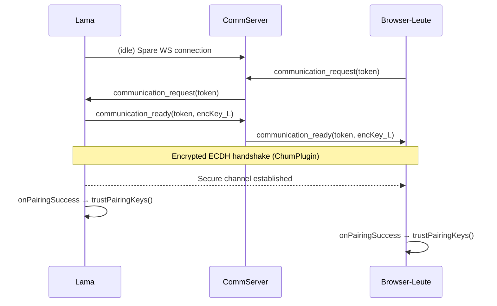

# Lama ↔ Leute Invitation / Pairing Protocol Flow

This document traces the **end-to-end control– and data-flow** for a standard invitation based pairing session between two Refiniō ONE clients (lama ↔ one.leute).

> The steps below were verified against the current lama code-base (July 2025) and the reference implementation in **@refinio/one.leute**.  Function / file names are given so you can jump directly to the relevant sources.

---

## 0  Players & Important Classes  
| Side | Purpose | Main Classes |
|------|---------|--------------|
| _Inviter_ (lama) | Generates invitation & waits for peer | `CommServerManager` → `ConnectionsModel.pairing` |
| _Invitee_ (browser leute) | Accepts invitation | `ConnectionsModel.pairing` |
| Both | Transport & handshake | `ConnectionsModel` • `LeuteConnectionsModule` • `ConnectionRouteManager` |
| Both | On successful pairing → create trust / contacts | `LeuteAccessRightsManager.trustPairingKeys()` |

---

## 1  Invitation Creation  ( lama )
1. **UI** → `InviteQRCode` asks **TransportManager** for an invitation.
2. `TransportManager.createInvitation()` delegates to **CommServerManager**.
3. **CommServerManager** pulls `const pm = connectionsModel.pairing` and executes `pm.createInvitation()` → `PairingManager.createInvitation()`
   * Stores `pairingToken` in local DB (expires `pairingTokenExpirationDuration`, default 15 min).
   * Encodes JSON invitation with:
     ```jsonc
     {
       "commServerUrl": "wss://comm10.dev.refinio.one",
       "personEncKey": "<hex>",        // inviter person key
       "instanceEncKey": "<hex>",      // inviter *instance* key (preferred)
       "token": "<uuid>"
     }
     ```
4. Invitation is shown as QR / URL (e.g. `refinio://invite#<base64-json>`).

---

## 2  Invitation Acceptance  ( one.leute )
1. Browser reads the URL fragment and calls `connectionsModel.pairing.connectUsingInvitation(invitation)`.
2. **PairingManager** parses JSON and creates a _spare_ WebSocket **Connection A** to the `commServerUrl`.
   * Sent message sequence (see `PairingProtocol.ts`):
     ```text
     1  communication_request {token}
     2  → commServer forwards to inviter
     3  communication_ready  {token, publicKey}
     ```
3. When lama receives `communication_request` it binds one of its spare connections created by **LeuteConnectionsModule**.

---

## 3  Encrypted Connection Handshake  (both)
1. Both sides inject **ChumPlugin** early in the `Connection` plugin chain (`createLamaConnectionsModel()` sets `connectionClass=LamaConnection` which auto-adds plugin).
2. Standard ECDH handshake → symmetric keys.
3. `connection.promisePlugin()` resolves → connection promoted to **online**.
4. **ConnectionsModel** fires `onProtocolStart` then `onConnectionsChange`.

---

## 4  Pairing Success Callback
1. `PairingManager` verifies the token and emits **`onPairingSuccess`** _once per side_.
2. In lama we register the callback **once** (constructor of `LeuteAccessRightsManager`):
   ```ts
   connectionsModel.pairing.onPairingSuccess(
     trustPairingKeys.bind(this, leuteModel.trust)
   );
   ```

---

## 5  trustPairingKeys()  (lama)
Source `src/models/LeuteAccessRightsManager.ts`.

| Step | Action |
|------|--------|
| 5.1 | **Fetch remote Keys** → `getAllEntries(remotePersonId, 'Keys')` |
| 5.2 | **Construct Profile** → `ProfileModel.constructWithNewProfile(remotePersonId, localPersonId, 'default', [], [SignKey])` |
| 5.3 | **Certify keys** → `trust.certify('TrustKeysCertificate', {profile})` + `trust.refreshCaches()` |
| 5.4 | **Create Someone** contact → `SomeoneModel.constructWithNewSomeone('contact-<hash>', profile.loadedVersion)` |
| 5.5 | **Add contact** → `contactsModel.addContact(newSomeone)` |
| 5.6 | **Refresh connection cache** → `connectionsModel.updateConnectionsCache()` (wrapper added in `createLamaConnectionsModel` delegates to `LeuteConnectionsModule.updateCache()`) |

After 5.6 the `knownPeerMap` contains the new endpoint; future connections are treated as **known** (see `onKnownConnection`).

---

## 6  Resulting Runtime State
* `Profile`, `Someone`, `OneInstanceEndpoint` objects written to ONE DB.
* Both peers have a live CHUM channel over the CommServer WebSocket.
* Further messages use the CHUM protocol (content addressed push / pull, synchronisation).

---

## 7  Error Handling Notes
| Symptom | Likely Cause | Fix |
|---------|--------------|-----|
| `onUnknownConnection()` fires & connection rejected | Cache not updated → `knownPeerMap` miss | Ensure `updateConnectionsCache()` is called **after** trust creation |
| `connection.promisePlugin is not a function` | Missing `ChumPlugin` injection | Verify `LamaConnection` wrapper class adds plugin before constructor returns |
| Duplicate pairing callbacks | More than one `onPairingSuccess` registration | Keep only `LeuteAccessRightsManager` handler – remove others |

---

## 8  Sequence Diagram (Mermaid)


---

## 9  Key Source Files
* `src/models/network/connections/index.ts` – `createLamaConnectionsModel`, `LamaConnection`
* `src/models/network/transports/CommServerManager.ts` – invitation API wrapper
* `src/models/LeuteAccessRightsManager.ts` – pairing success processing
* `node_modules/@refinio/one.models/.../LeuteConnectionsModule.js` – cache & routing

---

### End of Document 

---

## 10  Reference one.leute Flow (Browser-side)
The **one.leute** web-app follows the same high-level steps but the implementation details differ slightly:

1. **Model Initialisation** – see `one.leute/src/model/Model.ts`
   ```ts
   this.connections = new ConnectionsModel(this.leuteModel, {
     commServerUrl,
     acceptIncomingConnections: true,
     acceptUnknownInstances: true,     // browser allows unknown *instance* keys
     acceptUnknownPersons: false,      // still rejects totally unknown persons
     allowPairing: true,
     establishOutgoingConnections: true,
     allowDebugRequests: true,
     pairingTokenExpirationDuration: 15 * 60_000
   });
   ```
   *No* additional abstraction layer – the browser talks to `ConnectionsModel` directly.

2. **Invitation Acceptance** – handled by `one.leute/src/utils/pairing.ts`:
   * `tryPairing()` parses the invite and calls `connections.pairing.connectUsingInvitation()`.
   * Retries up to 4× with a 2 s back-off.
   * After pairing success it optionally creates an **IoM request** (Internet-of-Me) via `IoMRequestManager.createIoMRequest()`.

3. **Key Trust & Contact Creation** – `one.leute/src/model/LeuteAccessRightsManager.ts` registers **one** pairing success handler in its **constructor**:
   ```ts
   connectionsModel.pairing.onPairingSuccess(
     LeuteAccessRightsManager.trustPairingKeys.bind(this, leuteModel.trust)
   );
   ```
   The static `trustPairingKeys()` implementation:
   1. Waits until the remote `Keys` object is available (remote sends it via CHUM).
   2. Builds a `SignKey` wrapper and constructs a **Profile** (`constructWithNewProfile`).
   3. Calls `trust.certify('TrustKeysCertificate', {profile})` and `trust.refreshCaches()`.
   4. **NOTE:** one.leute **does _not_** call `connectionsModel.updateCache()`.  Instead the subsequent creation of a `OneInstanceEndpoint` (written by the remote mobile peer) triggers `LeuteConnectionsModule.onNewOneInstanceEndpoint()` which in turn calls `setupRoutesForOneInstanceEndpoint()` and refreshes `knownPeerMap`.

4. **Access Rights** – After trust is established the web-app shares its main profile and questionnaire channels with the `iom` and replicant groups (see `giveAccessToChannels()` in the same file).

### Why Lama Needs `updateConnectionsCache()` But one.leute Doesn’t
In mobile lama we create the `Someone` + `OneInstanceEndpoint` locally **before** the remote browser sends any object updates, therefore we must refresh the cache immediately. one.leute, on the other hand, relies on the **remote** client to push its freshly created `OneInstanceEndpoint`. When that object arrives it triggers an automatic cache update path inside `LeuteConnectionsModule`.

If lama skipped the explicit cache refresh the first **incoming** CHUM connection from the browser would still be classified as "unknown" and get rejected. Hence the extra wrapper.

--- 